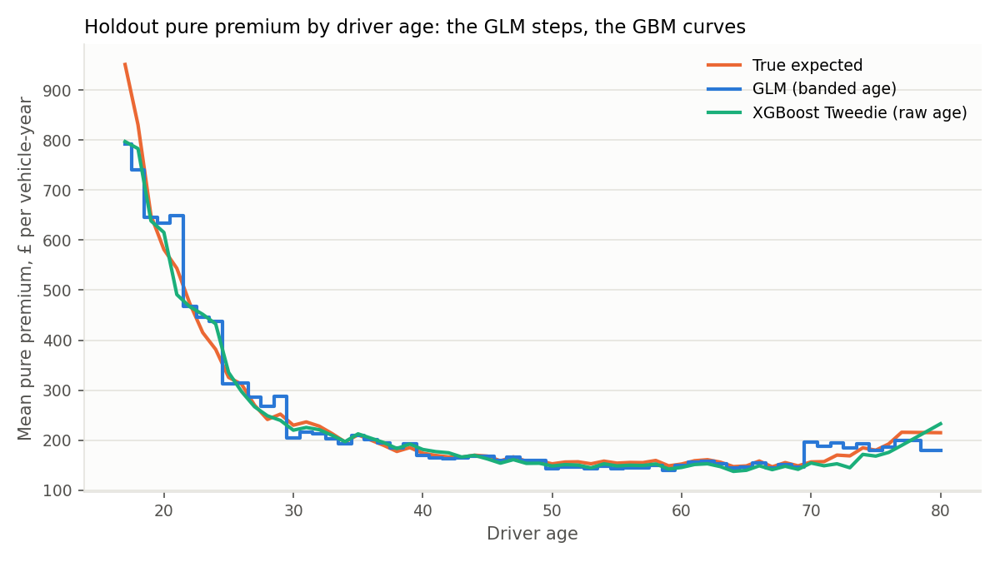

# Phase D: GLM vs gradient boosting

Script: `pricing/ml_comparison.py` · Outputs: `reports/tables/glm_vs_gbm_*.csv`,
`reports/tables/gbm_cv_depth_search.csv`, `reports/figures/glm_vs_gbm_by_age.png`

## Set-up

| | GLM (Phases B-C) | XGBoost Tweedie |
|---|---|---|
| Target | Frequency (NB, exposure offset) and severity (Gamma), multiplied | Pure premium in one model: `cost / exposure`, weight = exposure |
| Distribution | Negative Binomial x Gamma | Tweedie, p = 1.5 (compound Poisson-Gamma) |
| Age, NCD | Banded (8 and 5 levels) | Raw years |
| Interactions | Only the one I specified (young x VG4-5) | Whatever the trees find. No flag supplied |
| Tuning | Factor selection by LR/F-tests, AIC | Depth (1-4) and number of trees by 5-fold CV on training data, then a balance correction (×1.009) |

**CV picked depth-1 trees (782 trees)** over depths 2-4. With depth 1, every
tree splits on a single feature, so the model is a sum of one-factor effects on
the log scale. That is structurally a GLM whose factors are shaped
non-parametrically instead of banded by hand (a GAM). CV preferred it because
the true risk really is multiplicative, and deeper trees mostly fitted noise.
Deeper trees did not find the young × VG4-5 interaction either (checked at
depth 4). The interaction cell has only about 2,000 vehicle-years of exposure.

## Results (20% holdout, 29,943 policies)

| Metric | GLM | XGBoost |
|---|---|---|
| Total predicted / total true | 0.984 | 0.983 |
| Correlation, log price vs log true | 0.990 | **0.991** |
| Mean absolute % error vs true | 6.7% | **6.3%** |
| Policies within 10% of true | 78.6% | **81.0%** |
| Tweedie deviance vs observed claims | **84.09** | 84.18 |
| Normalised Gini vs observed claims | 0.383 | 0.383 |

**The two models are practically tied.** XGBoost is slightly closer to the
true risk, and the GLM has slightly lower deviance against observed claims.
Their Gini coefficients against observed claims are identical to three decimal
places. On one year of noisy claims you could not tell them apart. The
comparison against the truth is only possible because the data is simulated.

The two models agree to within 10% on 75% of policies, and to within 20% on
96%.

## Where they diverge, and why

**1. Within-band age shape: the GBM wins.** The GLM charges one relativity per
age band, so it steps. The GBM follows the true curve continuously. The clearest
case is age 21, the last year of the 17-21 band: the GLM charges 24% above the
true risk, while the GBM is within 1%. Every band edge has a smaller version of
this. It accounts for most of the GBM's slight edge, and it comes from the
feature engineering, not from boosting as such. Splines or finer bands would
give the GLM the same shape.

**2. The young driver × high vehicle group interaction: the GLM wins.**

| Segment (holdout) | Exposure | GLM / true | GBM / true |
|---|---|---|---|
| Age 25+ | 23,731 | 0.98 | 0.99 |
| Under 25, VG1-3 | 2,230 | 1.03 | 1.07 |
| **Under 25, VG4-5** | 416 | **0.93** | **0.77** |

The GBM under-prices young drivers in powerful cars by 23%. That is the
highest-risk segment in the book and the one most exposed to anti-selection. In
a real market, competitors who price it correctly would decline those risks,
and this book would write them. The GLM includes the interaction because I
specified it from domain knowledge and it passed a significance test. The GBM
could in principle learn it, but CV chose depth-1 trees, which cannot represent
interactions. The segment is also too thin for the model to justify the split.

The flexible model is not automatically better where it matters most. A
data-driven model finds structure only where there is enough data, while a
priced interaction can be based on underwriting knowledge and then tested.

## Why the industry has relied on GLMs, and where ML fits

| | GLM | Gradient boosting |
|---|---|---|
| **Transparency** | Every price is `base × relativity × relativity × …`. Each factor can be read, reviewed and signed off | The prediction is the sum of 782 trees. Explaining it requires SHAP or partial-dependence plots, which are approximations |
| **Regulation** | Easy to show regulators (FCA, and the GIPP pricing-practices rules in the UK) which factors are used and how much each moves the price, and to show a factor isn't a proxy for a protected characteristic | Harder to demonstrate. Proxy effects can hide inside interactions |
| **Implementation** | Rating tables drop straight into rating engines (Radar Live, Earnix, in-house) | Needs model deployment, or must be distilled back into tables |
| **Control** | Actuaries can smooth, cap, or override one relativity for business reasons without refitting | Adjustments mean refitting or post-hoc overlays |
| **Flexibility** | Non-linearity and interactions must be specified by hand | Finds non-linearity and interactions automatically, where data supports them |
| **Data efficiency** | Structure from domain knowledge works on thin segments (see young × VG4-5) | Needs data volume to justify each split |

### How I'd use them together in practice

1. **GLM as the production tariff.** It is transparent, controllable and
   implementable.
2. **GBM as a challenger and diagnostic.** Where the GBM and GLM disagree
   systematically, look for missing structure. Here, the GBM's age curve would
   prompt finer age banding or a spline in the GLM. Interaction detection
   (for example GBM residuals or H-statistics) on a richer dataset could find
   candidate interactions to test in the GLM.
3. **Keep the choice evidence-based.** In this exercise the ML model gave about
   0.4 points of MAPE improvement, got the most dangerous segment wrong, and was
   indistinguishable on real-world metrics (Gini, deviance). That trade-off
   does not justify giving up transparency. On a book with strong,
   well-supported non-linear interactions (telematics, for example) the answer
   could be different, and I would expect the GBM to earn its place there.
