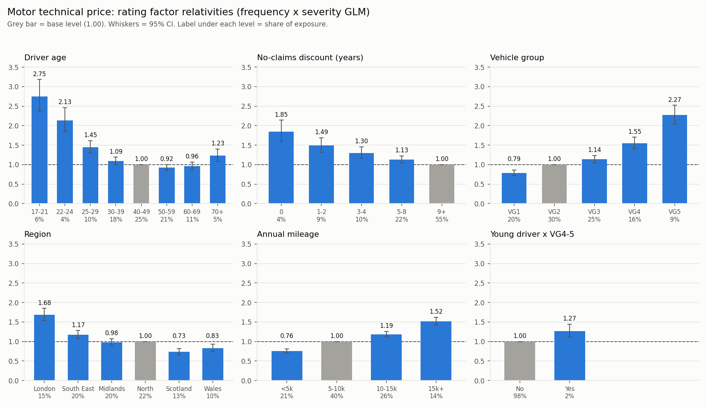

# Rating factor tables

_Generated by `pricing/rating_factors.py` - do not edit by hand._

Multiplicative relativities from the frequency (Negative Binomial) and severity (Gamma) GLMs, both log link, normalised to the base level of each factor (the level with the most exposure).

**Base rate: £112.99** per vehicle-year: the technical price for the base risk (age 40-49, NCD 9+, VG2, North, 5-10k miles).

Check: base rate x relativities reproduces the GLM technical price on every holdout policy (max relative difference 2.0e-15).

## Driver age

| Level | Exposure | Claims | One-way freq | Freq rel | Sev rel | **Relativity** | 95% CI |
|---|---|---|---|---|---|---|---|
| 17-21 | 6,649 | 1373 | 0.206 | 2.430 | 1.132 | **2.751** | 2.38 - 3.18 |
| 22-24 | 4,018 | 560 | 0.139 | 1.881 | 1.132 | **2.130** | 1.84 - 2.46 |
| 25-29 | 10,796 | 1073 | 0.099 | 1.450 | 1.000 | **1.450** | 1.30 - 1.62 |
| 30-39 | 18,708 | 1215 | 0.065 | 1.093 | 1.000 | **1.093** | 1.00 - 1.19 |
| 40-49 (base) | 26,299 | 1428 | 0.054 | 1.000 | 1.000 | **1.000** | 1.00 - 1.00 |
| 50-59 | 22,583 | 1089 | 0.048 | 0.921 | 1.000 | **0.921** | 0.85 - 1.00 |
| 60-69 | 11,952 | 596 | 0.050 | 0.964 | 1.000 | **0.964** | 0.87 - 1.07 |
| 70+ | 4,834 | 307 | 0.064 | 1.231 | 1.000 | **1.231** | 1.08 - 1.40 |

## No-claims discount (years)

| Level | Exposure | Claims | One-way freq | Freq rel | Sev rel | **Relativity** | 95% CI |
|---|---|---|---|---|---|---|---|
| 0 | 3,910 | 851 | 0.218 | 1.846 | 1.000 | **1.846** | 1.59 - 2.14 |
| 1-2 | 9,206 | 1285 | 0.140 | 1.490 | 1.000 | **1.490** | 1.32 - 1.69 |
| 3-4 | 10,345 | 975 | 0.094 | 1.302 | 1.000 | **1.302** | 1.17 - 1.45 |
| 5-8 | 23,729 | 1526 | 0.064 | 1.128 | 1.000 | **1.128** | 1.04 - 1.22 |
| 9+ (base) | 58,650 | 3004 | 0.051 | 1.000 | 1.000 | **1.000** | 1.00 - 1.00 |

## Vehicle group

| Level | Exposure | Claims | One-way freq | Freq rel | Sev rel | **Relativity** | 95% CI |
|---|---|---|---|---|---|---|---|
| VG1 | 20,767 | 1435 | 0.069 | 0.896 | 0.880 | **0.788** | 0.72 - 0.86 |
| VG2 (base) | 32,066 | 2189 | 0.068 | 1.000 | 1.000 | **1.000** | 1.00 - 1.00 |
| VG3 | 26,514 | 1817 | 0.069 | 1.041 | 1.093 | **1.139** | 1.05 - 1.24 |
| VG4 | 16,599 | 1297 | 0.078 | 1.167 | 1.328 | **1.550** | 1.41 - 1.70 |
| VG5 | 9,895 | 903 | 0.091 | 1.389 | 1.635 | **2.270** | 2.04 - 2.52 |

## Region

| Level | Exposure | Claims | One-way freq | Freq rel | Sev rel | **Relativity** | 95% CI |
|---|---|---|---|---|---|---|---|
| London | 15,944 | 1330 | 0.083 | 1.168 | 1.440 | **1.683** | 1.53 - 1.85 |
| South East | 21,101 | 1534 | 0.073 | 0.923 | 1.270 | **1.172** | 1.07 - 1.28 |
| Midlands | 21,267 | 1496 | 0.070 | 0.903 | 1.081 | **0.977** | 0.89 - 1.07 |
| North (base) | 23,304 | 1829 | 0.078 | 1.000 | 1.000 | **1.000** | 1.00 - 1.00 |
| Scotland | 13,519 | 795 | 0.059 | 0.755 | 0.972 | **0.734** | 0.66 - 0.82 |
| Wales | 10,705 | 657 | 0.061 | 0.788 | 1.048 | **0.826** | 0.73 - 0.93 |

## Annual mileage

| Level | Exposure | Claims | One-way freq | Freq rel | Sev rel | **Relativity** | 95% CI |
|---|---|---|---|---|---|---|---|
| <5k | 21,706 | 1146 | 0.053 | 0.759 | 1.000 | **0.759** | 0.71 - 0.81 |
| 5-10k (base) | 42,265 | 2858 | 0.068 | 1.000 | 1.000 | **1.000** | 1.00 - 1.00 |
| 10-15k | 27,087 | 2146 | 0.079 | 1.186 | 1.000 | **1.186** | 1.12 - 1.26 |
| 15k+ | 14,782 | 1491 | 0.101 | 1.519 | 1.000 | **1.519** | 1.42 - 1.62 |

## Young driver x VG4-5

| Level | Exposure | Claims | One-way freq | Freq rel | Sev rel | **Relativity** | 95% CI |
|---|---|---|---|---|---|---|---|
| No (base) | 104,230 | 7203 | 0.069 | 1.000 | 1.000 | **1.000** | 1.00 - 1.00 |
| Yes | 1,610 | 438 | 0.272 | 1.270 | 1.000 | **1.270** | 1.12 - 1.44 |

## Worked example

Pricing one policy straight off the tables:

| Step | Level | Multiplier |
|---|---|---|
| Base rate |  | £112.99 |
| Driver age | 17-21 | × 2.751 |
| No-claims discount (years) | 1-2 | × 1.490 |
| Vehicle group | VG4 | × 1.550 |
| Region | London | × 1.683 |
| Annual mileage | 10-15k | × 1.186 |
| Young driver x VG4-5 | Yes | × 1.270 |

**Technical price = £1,818.81 per vehicle-year.**
