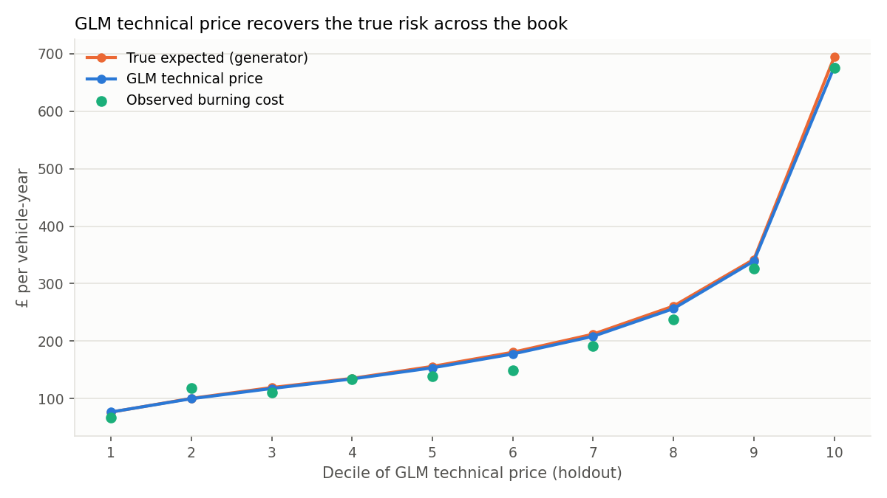

# Phase C: severity GLM, technical price and sense-check

Script: `pricing/glm_severity.py` · Outputs: `reports/tables/severity_*.csv`,
`reports/tables/technical_price_*.csv`, `reports/figures/technical_price_deciles.png`

## Severity model

```
avg_cost = claim_cost / claim_count      (policies with >= 1 claim)
avg_cost ~ Gamma(mu, phi / claim_count)
log(mu)  = b0 + young_driver + vehicle_group + region
```

- **Gamma, log link.** Claim costs are positive and right-skewed, and their
  variance grows with the mean (constant coefficient of variation). This is the
  standard severity choice.
- **Weighted by claim count.** An average of *n* claims has 1/*n* the variance
  of one claim. Weighting by count is equivalent to modelling each claim.
- **Dispersion is estimated** (Pearson, φ ≈ 0.67; the generator's true value is
  1/1.5 = 0.67). Because φ is estimated, nested models are compared with
  **F-tests on deviance**, not chi-square.
- Trained on the 7,102 training policies with a claim (7,641 claims).

| Model | Specification | Params | Deviance | AIC | BIC |
|---|---|---|---|---|---|
| S1 | Age band + NCD + vehicle group + region + mileage | 24 | 5,242.1 | 127,154.4 | 5,454.9 |
| S2 | Age band + vehicle group + region | 17 | 5,247.8 | 127,148.9 | 5,398.6 |
| **S3** | **Young-driver flag + vehicle group + region** | **11** | 5,253.4 | **127,145.2** | **5,351.0** |

| Test | F | df | p |
|---|---|---|---|
| S1 → S2 (drop NCD, mileage) | 1.23 | 7 | 0.28 |
| S2 → S3 (age bands → single under-25 flag) | 1.39 | 6 | 0.21 |

**Selected: S3.** NCD and mileage drive *how often* people claim, not *how
much* a claim costs, so they belong in the frequency model but not the severity
model. The data agrees: neither test rejects the simpler model. This is the
point of modelling frequency and severity separately. Each rating factor enters
only the component where it has an effect, and those effects are easier to
explain than a single blended pure-premium effect.

| Factor | Level | Fitted | True (rebased) |
|---|---|---|---|
| Base severity (VG2, North, 25+) | | £2,314 | £2,318 |
| Vehicle group (vs VG2) | VG1 / VG3 / VG4 / VG5 | 0.88 / 1.09 / 1.33 / 1.64 | 0.89 / 1.11 / 1.33 / 1.67 |
| Region (vs North) | London / South East / Midlands | 1.44 / 1.27 / 1.08 | 1.47 / 1.25 / 1.09 |
| Region (vs North) | Scotland / Wales | 0.97 / 1.05 | 0.92 / 0.98 |
| Young driver (<25) | | 1.13 | 1.15 |

## Technical price

```
technical price = E[claims per vehicle-year] x E[cost per claim]
                = exp(freq linear predictor) x exp(sev linear predictor)
```

Both models use a log link, so the technical price is a base rate multiplied by
one relativity per rating factor. Phase E turns this into a rating factor table.
This assumes frequency and severity are independent given the rating factors,
which is the standard assumption and is true in the generator.

## Sense-check against the true risk (20% holdout, 29,943 policies)

The generator stores each policy's true expected pure premium. On the holdout:

| Metric | GLM technical price | Flat rate (no rating) |
|---|---|---|
| Total predicted / total true | 0.984 | 0.982 |
| Correlation, log price vs log true | **0.990** | n/a |
| Mean absolute % error vs true | **6.7%** | 66.8% |
| Policies within 10% of true | **78.6%** | 10.7% |
| Policies within 20% of true | **96.3%** | 20.9% |



Sorted into deciles of predicted price, the GLM line lies almost on top of the
true line, from about £77 in decile 1 to about £680 in decile 10 (a 9x spread).
The observed burning cost (green) scatters around both, which is the noise any
single year of claims contains. The model fits the underlying risk, not that
noise.

The 1.6% overall shortfall is sampling error. Predicted frequency is only 0.4%
below the truth (7.22% vs 7.25%), so most of the gap is in severity. The mean of
about 7,600 training claims with a CV of 0.82 has a standard error of about 0.9%,
so a 1.2% miss is within normal noise. In practice this is fixed by an
off-balance / base-rate adjustment to a target loss cost, not by changing
relativities.

### Where the recovery is imperfect, and why

**1. Age vs NCD aliasing.** Band-level frequency relativities compared with the
true curves averaged within each band:

| Age band | Fitted | True | | NCD band | Fitted | True |
|---|---|---|---|---|---|---|
| 17-21 | 2.43 | 2.25 | | 0 | 1.85 | 1.88 |
| 22-24 | 1.88 | 1.54 | | 1-2 | 1.49 | 1.69 |
| 25-29 | 1.45 | 1.30 | | 3-4 | 1.30 | 1.47 |
| 30-39 | 1.09 | 1.05 | | 5-8 | 1.13 | 1.19 |
| 70+ | 1.23 | 1.26 | | 9+ | 1.00 | 1.00 |

Young age bands are slightly overstated and low-NCD bands slightly understated.
Age and NCD are strongly correlated (a 22-year-old cannot have 9 years' NCD),
so the likelihood can move some of the effect between them while the combined
price stays about the same. The combined price is what is recovered to 6.7%.
In a real review this is where I would check correlation and consistency
across years. I might also smooth or constrain one factor (for example, fit
NCD as a linear term in years) so each relativity is stable and explainable
on its own, not just correct in combination.

**2. Banding a continuous effect.** The true age effect is a smooth curve. Within
the 17-21 band, true frequency falls from 2.8x at 17 to 1.8x at 21, but the GLM
charges the whole band one relativity. Finer bands, splines or a fitted curve
would reduce this. Phase D shows the GBM picking it up automatically.
